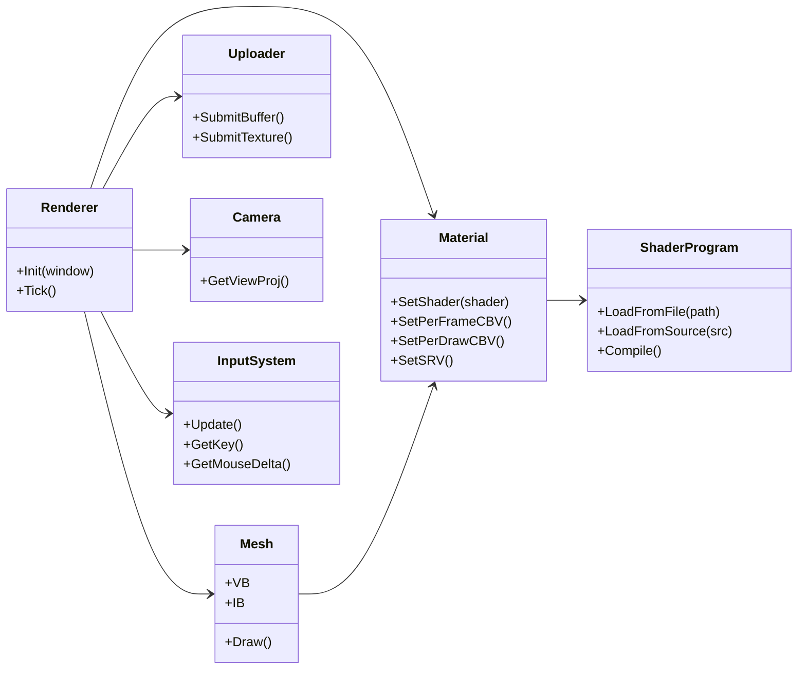

생각한 것 : 오브젝트 출력 + 셰이더 적용 + 간단 입력

1. RHI  
(RHI : Render Hardware Interface. 그래픽 API들을 래핑한 공용 C++ 인터페이스)  
<b>COM 1개 ⇔ 객체 1개</b> 매핑  
    D3D12Device, D3D12Swapchain, D3D12CommandQueue, D3D12CommandAllocator, D3D12GraphicsCommandList, D3D12Fence, D3D12Resource, D3D12DescriptorHeap.

2. Wrapper
    - Renderer
    - Mesh : VB(Vertex Buffer), IB(Index Buffer) 가지고 있음
    - ShaderProgram : HLSL 소스/파일 → 컴파일(DXC 사용) → RootSignature/PSO 생성
      - RootSignature : 셰이더가 사용하는 리소스 바인딩에 대한 규약
      - PSO : PipelineStateObject. 파이프라인의 상태를 정의해주는 객체.
    - Material : ShaderProgram + 파라미터(CBV-상수 버퍼 뷰/SRV-셰이더 리소스 뷰 등...) 바인딩
    - Uploader : 스테이징 버퍼로 VB/IB/텍스처 업로드
    - Camera

3. InputSystem
    - 키/마우스 상태 가져와서 Camera 이동/회전에 반영?
    - 윈도우 메시지 처리

